# CI/CD Semantic Versioning & Release Promotion Strategy

Welcome to the versioning strategy overview! This document outlines how I handle automated semantic versioning and release promotion across a 4-tier CI/CD environment. 

I rely on two custom, purpose-built GitHub Actions:

1. **[`next-version`](.github/actions/next-version/Readme.md)**: Used during the Continuous Integration (CI) phase. Its job is **generation**—it analyzes existing Git tags and computes the correct *next* version (usually by bumping the minor version and adding an `alpha` suffix).
2. **[`promote-version`](.github/actions/promote-version/Readme.md)**: Used during the Continuous Delivery (CD) phase. Its job is **progression**—it takes a known existing prerelease version and safely advances its suffix state as the artifact successfully moves through deployment environments, culminating in a stable production tag.

---

## The 4-Tier Environment Mapping

I'll give an example of 4 environments. Each environment is strictly bound to a semantic version prerelease suffix.

| Environment | Suffix | Tool Used | Output Example |
| :--- | :--- | :--- | :--- |
| **Integration (INT)** | `alpha` | `next-version` | `v1.3.0-alpha.1` |
| **Staging (STG)** | `beta` | `promote-version` | `v1.3.0-beta.1` |
| **User Acceptance Testing (UAT)** | `rc` | `promote-version` | `v1.3.0-rc.1` |
| **Production (PROD)** | *(none)* | `promote-version` | `v1.3.0` |

---

## The Version Lifecycle

```mermaid
graph LR
    A[Code Push to main] -->|CI triggers next-version| B(INT: v1.3.0-alpha.1)
    B -.->|Many builds later...| B2(INT: v1.3.0-alpha.15)
    B2 -->|CD deploy to Staging| C(STG: v1.3.0-beta.1)
    C -.->|Several STG builds...| C2(STG: v1.3.0-beta.5)
    C2 -->|CD deploy to UAT| D(UAT: v1.3.0-rc.1)
    D -.->|A minor RC fix...| D2(UAT: v1.3.0-rc.2)
    D2 -->|CD approval & deploy| E(PROD: v1.3.0)
    
    style A fill:#e1f5fe,stroke:#333,stroke-width:2px
    style B fill:#fff9c4,stroke:#0288d1,stroke-width:2px;
    style B2 fill:#fff9c4,stroke:#0288d1,stroke-width:2px;
    style C fill:#ffe0b2,stroke:#fbc02d,stroke-width:2px;
    style C2 fill:#ffe0b2,stroke:#fbc02d,stroke-width:2px;
    style D fill:#f8bbd0,stroke:#f57c00,stroke-width:2px;
    style D2 fill:#f8bbd0,stroke:#f57c00,stroke-width:2px;
    style E fill:#c8e6c9,stroke:#388e3c,stroke-width:2px;
```



### A Realistic Scenario

Imagine the last stable version in the repo is `v1.2.0`. I merge a new feature to the `main` branch, kicking off an active development sprint:

1. **Continuous Integration (INT)** 
   Over the course of the sprint, many fixes and small changes are pushed. Each push triggers `next-version`. `v1.3.0-alpha.1`, then `v1.3.0-alpha.2`, all the way up until an iteration I think is finally ready: **`v1.3.0-alpha.15`**.
   
2. **Staging (STG)**
   I deploy `v1.3.0-alpha.15` to STG for deeper testing. Action `promote-version` processes this alpha tag and generates the first beta, `v1.3.0-beta.1`. As QA tests it, they find bugs. I push fixes, creating new alphas up to `v1.3.0-alpha.18`, and promote those to STG. The system auto-increments STG betas over time up to **`v1.3.0-beta.5`**.

3. **User Acceptance Testing (UAT)**
   The `v1.3.0-beta.5` build is rock solid. I push it to UAT where the product owner tests it. `promote-version` takes the beta and translates it to a release candidate: `v1.3.0-rc.1`. A typo is spotted at the last second, so I fix it, generating `alpha.19`, pushing to `beta.6`, and finally a new RC up to UAT: **`v1.3.0-rc.2`**.

4. **Production (PROD)**
   The final sign-off is given. I run the PROD deployment targeting `v1.3.0-rc.2`. `promote-version` is invoked with the `is-stable: true` flag. It strips away all prerelease information, generating the pristine, stable release tag: **`v1.3.0`**.

---

## Workflow Code Examples

Below are snippets demonstrating how to arrange your `.github/workflows` to facilitate this pipeline. 

### 1. Generating the Initial Version (CI)

```yaml
name: 1. CI - Build and Integration
on: 
  push:
    branches: [ main ]

jobs:
  build:
    runs-on: ubuntu-latest
    steps:
      - name: Checkout Code
        uses: actions/checkout@v4
        with:
          fetch-depth: 0 # Required to see historical git tags

      - name: Generate next Alpha Version
        id: generate-version
        uses: anvaplus/github-actions-common/.github/actions/next-version@main
        with:
          version-type: 'alpha'
          tag-repo: 'true'

      - name: Report
        run: echo "Generated integration build: ${{ steps.generate-version.outputs.new-version }}"
        # Output: v1.3.0-alpha.1
```

### 2. Progressing through Environments (CD)

Because artifact promotion isn't always immediately triggered by code pushes (it might be a manual trigger or based on test success events), here is an example of what the CD steps look like for `STG`, `UAT`, and `PROD`.

#### Deploy to STG (Beta)

```yaml
      - name: Promote to Beta (STG)
        id: promote-stg
        uses: anvaplus/github-actions-common/promote-version@main
        with:
          version: 'v1.3.0-alpha.1' # Usually passed dynamically e.g. ${{ inputs.artifact_version }}
          promote-type: 'beta'
          tag-repo: 'true'
          
      # Output: v1.3.0-beta.1
```

#### Deploy to UAT (RC)

```yaml
      - name: Promote to RC (UAT)
        id: promote-uat
        uses: anvaplus/github-actions-common/promote-version@main
        with:
          version: 'v1.3.0-beta.1'
          promote-type: 'rc'
          tag-repo: 'true'
          
      # Output: v1.3.0-rc.1
```

#### Deploy to PROD (Stable)

For production, we no longer provide a `promote-type`. Instead, we set the `is-stable` flag to forcefully strip all suffixes cleanly.

```yaml
      - name: Promote to Stable (PROD)
        id: promote-prod
        uses: anvaplus/github-actions-common/promote-version@main
        with:
          version: 'v1.3.0-rc.1'
          is-stable: 'true'
          tag-repo: 'true'
          
      # Output: v1.3.0
```

---

By adhering to this two-action strategy, I maintain a clean, linear, and thoroughly traceable history mapping exactly what code ran in which environment at any given time.
